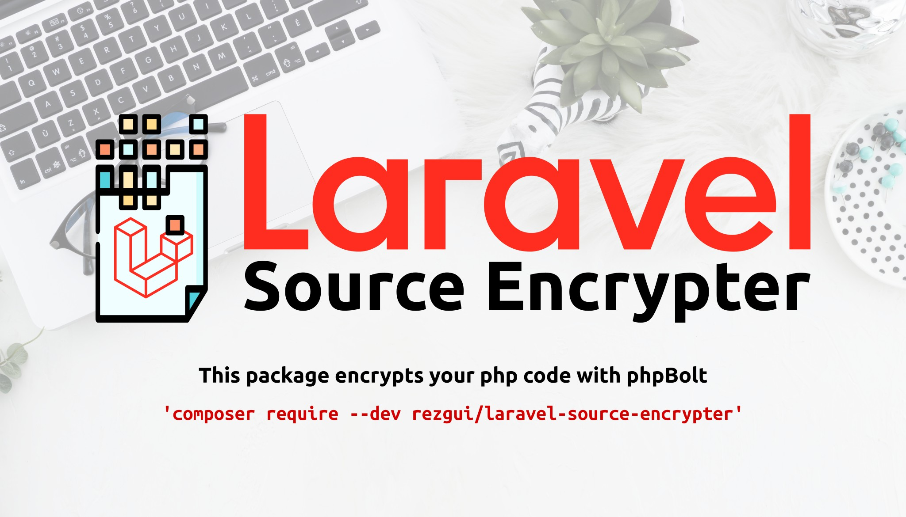

# Laravel Source Encrypter for Laravel and Lumen 6, 7, 8, 9, 10 , 11

[](https://github.com/rezgui/Laravel-Source-Encrypter)
[](https://packagist.org/packages/rezgui/laravel-source-encrypter)
[](https://www.codefactor.io/repository/github/rezgui/laravel-source-encrypter)
[](https://packagist.org/packages/rezgui/laravel-source-encrypter)
[](https://packagist.org/packages/rezgui/laravel-source-encrypter) 



This package encrypts your php code with [phpBolt](https://phpbolt.com) 

* [Introduction](#introduction)
  * [Benifits of Encoding](#benifits-of-encoding)
* [phpBolt encoder](#phpbolt-encoder)
  * [Guide](#guide)
* [Installation Package](#installation-package)
* [Usage](#usage)

---

## Introduction

Many PHP developers need to protect their application source code before they distribute it to their customers and make it difficult for others to modify it without their permission.

- There are couple of techniques to protect PHP source code:

  - Making the code difficult to read – which involves in minification & obfuscation

  - **Encoding the source code.**

- There are list  of commercial PHP encoders (Zend, ionCube, SourceGuardian, NuCoder, etc).

- A free encoder called **phpBolt** saves you from buying commercial encoders. phpBolt helps to protect your PHP source code by encrypting and decrypting code using a key.

### Benifits of Encoding

- Anyone can reuse your PHP script to any web server or localhost. phpBolt will encrypt your source code with a key.
- Advance Protection -- Generate a specific key for each customer.
- Online Encryption -- Encrypt source code from online also possible.
- Encrypt PHP source code and obfuscate the PHP source code.
- Prevent your PHP product from the nulled world.

## phpBolt encoder

- The author doesn't care about issues! The author will help you only if you pay for that. (he cannot provide free support)
- phpBolt loader is an extension used to load PHP files protected and encoded using PHP encoder.

### Guide

1. **Download phpBolt extension for 64-bit System**

    - In order to use phpBolt, you need to [download loader extension](https://phpbolt.com/download-phpbolt/). Look for `bolt.so` inside the corresponding platform folder. ([extension](./assets/phpBolt-extension-1.0.5.zip))

    - Or, directly using following wget command:

        ```bash
        cd /tmp
        wget https://phpbolt.com/wp-content/uploads/2024/03/phpBolt-extension-1.0.5.zip
        ```

    - Then unzip the downloaded file using the unzip command and move into the decompressed folder.

    - This is a mandatory step. Because PHP engine needs to identify then functions `bolt_encrypt` and `bolt_decrypt` functions.

2. **Install bolt.so extension for PHP**

    - There will be different phpBolt loader files for various PHP versions, you need to select the right phpBolt loader for your installed PHP version on your server.

    - Next, find the location of the extension directory for PHP version **8.2.25** (for example), it is where the phpBolt loader file will be installed. The specified directory from the output of this command:

        ```sh
        php -i | grep extension_dir
        # output:
        # extension_dir => /usr/lib/php/20220829 => /usr/lib/php/20220829
        ```

    - Copy `bolt.so` from the respective platform folder into the folder where all PHP extensions are stored. In my case, `/usr/lib/php/20220829` was the folder that stores all PHP extensions.

3. **Configure phpBolt Loader for PHP**

    - Find the `php.ini` file and add `extension='/usr/lib/php/20220829/bolt.so'` in `php.ini` file. Then restart your server. Please choose correct `bolt.so` file. `bolt.so` is diffrent for each version and OS.

    - Open `php.ini` as following: `sudo nano /etc/php.ini`

    - Add `blot.so` extension: `extension='/absolute-path/bolt.so'`

    - __Note:__
        ```text
        You will be encrypting using CLI,
        then you have to add extension in: `/etc/php/8.2/cli/php.ini` file,
        and in: `php/8.2/apache2/php.ini` file to decode the source code.
        (**Don't forget to restart server**)
        idem for FPM
        ```
      
    - Remember to replace absolute-path with the path of the extension. In my case: `extension='/usr/lib/php/20220829/bolt.so'`

    - Now we need to restart the Apache, Nginx, or php-fpm web server for the phpBolt loaders to come into effect.

    - Now you have successfully setup bolt loader extension.


## Installation Package

### Step 1
Require the package with composer using the following command:
```bash
composer require --dev rezgui/laravel-source-encrypter
```
### Step 2
#### For Laravel
The service provider will automatically get registered. Or you may manually add the service provider in your `config/app.php` file:
```php
'providers' => [
    // ...
    \rezgui\LaravelSourceEncrypter\SourceEncryptServiceProvider::class,
];
```

#### For Lumen
Add this line of code under the `Register Service Providers` section of your `bootstrap/app.php`:
```php
$app->register(\rezgui\LaravelSourceEncrypter\SourceEncryptServiceProvider::class);
```


### Step 3 (Optional)
You can publish the config file with this following command:
```bash
php artisan vendor:publish --provider="rezgui\LaravelSourceEncrypter\SourceEncryptServiceProvider" --tag=config
```
**Note:** If you are using Lumen, you have to use [this package](https://github.com/laravelista/lumen-vendor-publish).

## Usage
Open terminal in project root and run this command: 
```bash
php artisan encrypt-source
```
This command encrypts files and directories in `config/source-encrypter.php` file. Default values are `app`, `database`, `routes`.

The default destination directory is `encrypted`. You can change it in `config/source-encrypter.php` file.

Also the default encryption key length is `6`. You can change it in `config/source-encrypter.php` file. `6` is the recommended key length.

This command has these optional options:

| Option      | Description                                                          | Example                 |
|-------------|----------------------------------------------------------------------|-------------------------|
| source      | Path(s) to encrypt                                                   | app,routes,public/a.php |
| destination | Destination directory                                                | encrypted               |
| keylength   | Encryption key length                                                | 6                       |
| force       | Force the operation to run when destination directory already exists |                         |

### Usage Examples

| Command                                                       | Description                                                                                                       |
|---------------------------------------------------------------|-------------------------------------------------------------------------------------------------------------------|
| `php artisan encrypt-source`                                  | Encrypts with default source, destination and keylength. If the destination directory exists, asks for delete it. |
| `php artisan encrypt-source --force`                          | Encrypts with default source, destination and keylength. If the destination directory exists, deletes it.         |
| `php artisan encrypt-source --source=app`                     | Encrypts `app` directory to the default destination with default keylength.                                       |
| `php artisan encrypt-source --destination=dist`               | Encrypts with default source and key length to `dist` directory.                                                  |
| `php artisan encrypt-source --destination=dist --keylength=8` | Encrypts default source to `dist` directory and the encryption key length is `8`.                                 |

Written with ♥ by Siavash Bamshadnia, and update with ♥ by Yacine REZGUI.

Please support me by staring this repository.
